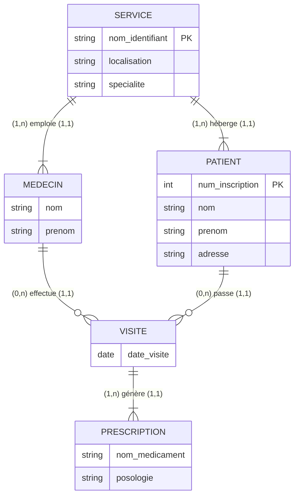

Hopital

![[Pasted image 20260205123602.png]]

![[Pasted image 20260205143317.png]]
MLD =>

Motivation(<u>id_mot</u>, intitulé)
Abonnee(<u>id_abo</u>, nom_abo, prenom_abo, age_abo, num_rue, nom_rue, code_postale, pays)
Newsletter(<u>id_news</u>, sujet, date_envoi, contenu)
Rubrique(<u>id_rub</u>, nom_rub)
Inscrit( #id_abo, #id_rub)
