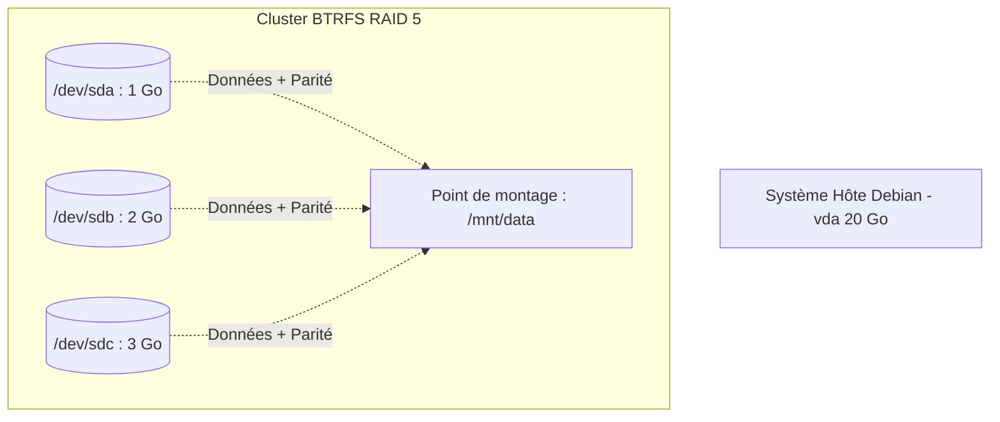
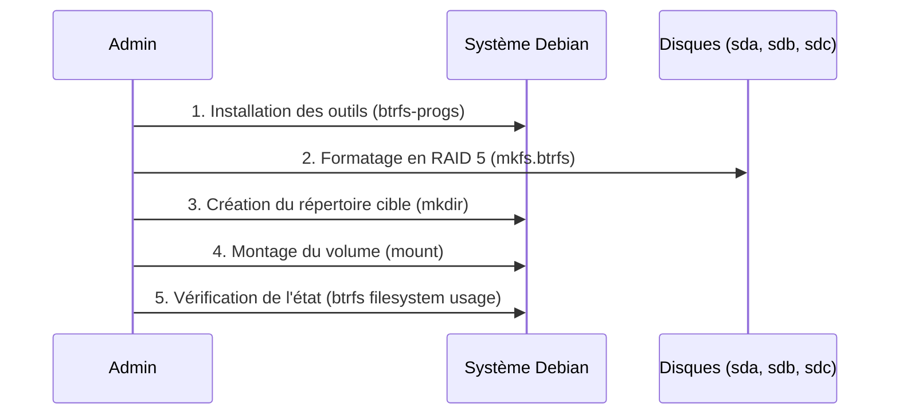

# Compte Rendu de TP : Déploiement d'un RAID 5 avec BTRFS

## 1. Contexte et Objectif

L'objectif de ce TP était de mettre en œuvre une architecture de stockage redondante en configurant plusieurs disques en RAID 5 avec le système de fichiers BTRFS.

Le choix du RAID 5 s'explique par sa capacité à répartir les données sur plusieurs disques pour améliorer les performances, tout en intercalant des bits de parité. Ces bits agissent comme des données de correction qui permettent de récupérer les informations en cas de défaillance matérielle d'un des disques. Cette configuration nécessite un minimum de 3 périphériques.


## 2. Environnement de travail

Contrairement au fascicule initialement prévu pour CentOS, j'ai réalisé ce TP sur une machine virtuelle fonctionnant sous Debian. L'infrastructure de stockage se compose du disque système principal et de trois disques virtuels ajoutés spécifiquement pour le cluster.




## 3. Déroulement des manipulations

Le processus de mise en place s'est déroulé en plusieurs phases, de l'installation des prérequis jusqu'à la vérification du volume fonctionnel.




### Étape 1 : Préparation du système

La première étape a consisté à identifier nos trois disques fraîchement ajoutés à l'aide de la commande `lsblk`. Contrairement à l'environnement natif du TP, les outils BTRFS n'étaient pas présents par défaut sur ma distribution Debian. Il a donc fallu mettre à jour les paquets et installer l'utilitaire requis avant de poursuivre :

```
apt update
apt install btrfs-progs
```

### Étape 2 : Création du système de fichiers

Une fois les outils installés et le répertoire de destination créé (`mkdir /mnt/data` ), j'ai pu initialiser la grappe de disques avec la commande suivante :

```
mkfs.btrfs -L data -d raid5 -m raid5 -f /dev/sda /dev/sdb /dev/sdc
```

Les paramètres appliqués permettent de structurer le comportement du volume :

- Le label du système de fichiers a été défini sur "data" grâce à l'option `-L`.
    
- Les données et les métadonnées ont été configurées pour utiliser un profil RAID 5 via les options `-d` et `-m`.
    
- L'option `-f` a été utilisée pour forcer la création et écraser tout système de fichiers potentiellement existant.
    

### Étape 3 : Montage et exploitation

La particularité de BTRFS est qu'il suffit de monter un seul périphérique de la grappe pour que le système assemble l'ensemble du volume. J'ai donc exécuté :

```
mount /dev/sda /mnt/data
```

La vérification s'est ensuite faite via les commandes classiques (`df -h`) et celles spécifiques à BTRFS (`btrfs filesystem usage /mnt/data` ) pour confirmer la bonne répartition de l'espace.

### Étape 4 : Évolution du cluster

Le TP abordait également la flexibilité de BTRFS face aux changements matériels. Le système autorise des opérations de maintenance à chaud, sans interruption de service :

- **Extension :** Il est possible d'ajouter un nouveau périphérique à la volée avec la commande `btrfs device add`.
    
- **Retrait sécurisé :** BTRFS offre la possibilité de retirer un disque, même s'il est défectueux, sans endommager les données. Lors de l'appel à la commande `btrfs device delete`, le système se charge de redistribuer intelligemment les blocs de données utilisés vers les autres disques du cluster avant de libérer le périphérique.